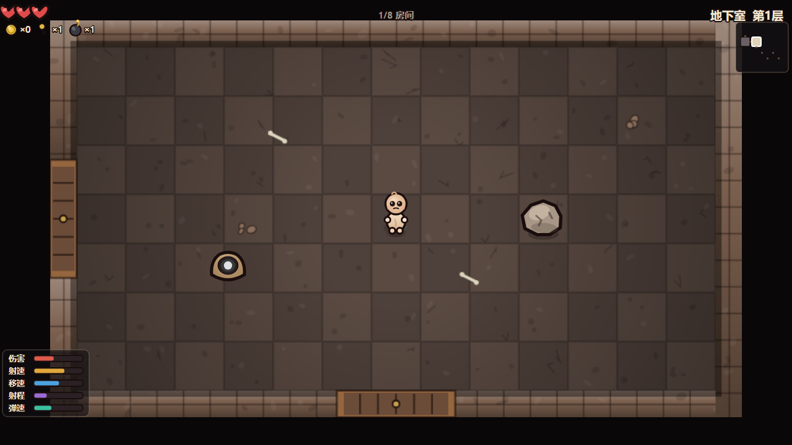
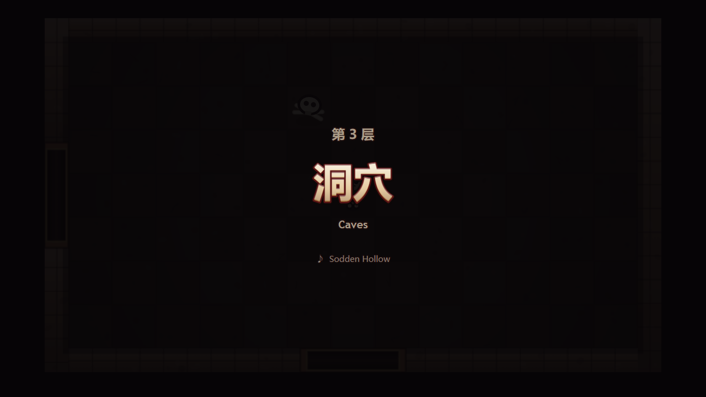
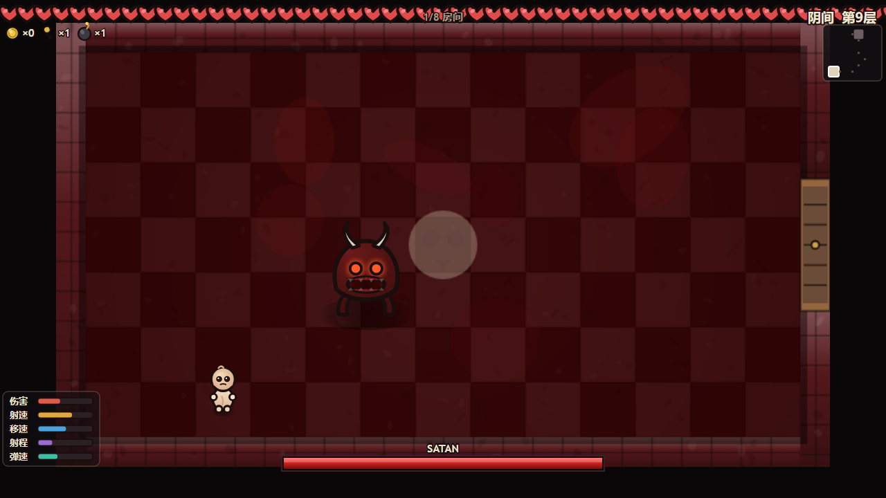

# The Binding of Isaac · Web（网页复刻版）

一个用**原生 HTML5 Canvas 2D + 原生 ES Modules** 复刻《以撒的结合》核心玩法的网页肉鸽地牢游戏。

> **零运行时依赖 · 零图片/音频素材**
> 所有美术（角色 / 敌人 / Boss / 房间 / 道具 / UI）与音效全部由代码实时生成。
> **在线即玩**：打开 👉 **<https://jaxuu.github.io/binding-of-isaac-web/>** 即可开玩；
> 也可下载到本地**双击 `dist/isaac-standalone.html`**（离线单文件），或跑源码（`index.html`，需静态服务）。

> 📖 **完整项目介绍**（功能特性 / 安装与使用 / 目录结构 / 技术栈 / 常见问题 / 许可证）
> 见 **[docs/项目介绍.md](docs/项目介绍.md)**。

---

## 界面预览

> 以下截图均取自**真实运行**的游戏（Playwright 驱动真实 Chromium，固定 `?seed=` 可复现），
> 未使用任何占位图或 AI 生图。

| 标题界面 | 游戏内 HUD（中文属性面板 + 小地图） |
|---|---|
|  |  |
| **关卡加载页**（第 N 层 + 楼层中文名 + 本层配乐名） | **Boss 战**（B9「阴间」· Satan） |
|  |  |

> 更多截图（B12 最终 Boss The Lamb、普通房战斗、移动端竖屏双摇杆）与逐张说明，
> 见 **[docs/项目介绍.md](docs/项目介绍.md)** 的「界面截图说明」一节。

---

## 快速开始

### 方式一 · 在线即玩（推荐 ⭐）

在浏览器打开下面的网址，**打开即玩**：

**👉 <https://jaxuu.github.io/binding-of-isaac-web/>**

- **无需安装任何东西**（不需要 Python / Node）
- **无需起服务**（不占用端口、不需要 localhost）
- 手机浏览器也能直接玩（触屏双摇杆自动显示）
- 由 **GitHub Pages** 托管，链接稳定、长期有效

> 想复现指定一局，在网址后加 `?seed=` 即可，例如
> <https://jaxuu.github.io/binding-of-isaac-web/?seed=777>。

### 方式二 · 本地双击即玩（离线单文件）

> ⚠️ **前置条件**：需先把本仓库下载到本地 —— 用
> `git clone https://github.com/Jaxuu/binding-of-isaac-web.git`，
> 或在仓库页点 **Code → Download ZIP** 后解压。拿到本地文件后，**双击**打开：

```
dist/isaac-standalone.html
```

- **无需安装任何东西**（不需要 Python / Node）
- **无需起服务**（不占用端口、不需要 localhost）
- **无需联网**（所有代码 / 样式已内联进这一个文件，可离线运行）
- 一个自包含单文件（约 424 KB），拷到 U 盘、发微信、丢到任意目录都能直接玩

> 该文件由 `tools/build-standalone.mjs` 把整棵 ES Module 依赖图打包成经典
> `<script>` 生成，因此**不受 `file://` 的 CORS 限制**。改了 `src/` 后重新生成：
>
> ```bash
> node tools/build-standalone.mjs   # 等价于 npm run build
> ```
>
> ⚠️ **这不违反「零构建步骤」原则**：直接跑 `index.html`（配静态服务）或双击
> `dist/isaac-standalone.html` 都**不需要任何构建**；`build` 只用于**重新生成分发包**
> （例如你改了源码、想把新版本打成单文件发给别人）。日常开发改完刷新即可见。

### 方式三 · 一键启动本地服务（模块化版本）

想直接跑源码（`index.html` + `src/`）时用：

```bash
# Windows：双击，或命令行运行
start.bat

# macOS / Linux
./start.sh
```

脚本会自动起一个 8080 端口的静态服务并打开浏览器。

> ⚠️ **推荐用 `start.bat` / `start.sh` 一键启动，不要手动起服务**：
> 本机若设了系统代理，`localhost` 请求可能被代理劫持返回 **502**。
> 一键脚本走 `127.0.0.1` 且端口固定，行为更可预期。

### 方式四 · 手动起 HTTP 服务（不推荐）

`index.html` 使用 ES Modules，**必须通过 HTTP 协议加载**（`file://` 会被浏览器 CORS 拦截，
表现为黑屏）。手动方式：

```bash
python -m http.server 8080      # 或 npx --yes serve -l 8080 .
```

### 复现指定一局

```
# 在线版本
https://jaxuu.github.io/binding-of-isaac-web/?seed=777

# 模块化版本
http://127.0.0.1:8080/?seed=777

# 单文件版本（双击后手动在地址栏加 ?seed=777 也可）
dist/isaac-standalone.html?seed=777
```

`seed` 支持任意整数或字符串（字符串走 FNV-1a 散列）。同一种子必然生成同一地牢。

---

## 操作说明

### 桌面（键盘）

| 操作 | 按键 |
|---|---|
| 移动（八向） | `W` `A` `S` `D` |
| 发射眼泪（四向独立） | `↑` `↓` `←` `→` |
| 暂停 / 继续 | `P` 或 `Esc` |
| 菜单确认 | `Space` 或 `Enter` |
| 死亡/通关后重开 | `R`（或点按钮） |
| 调试信息（FPS/实体数） | `F3` |

> 移动与射击**方向独立**（双摇杆式），可以一边后退一边朝敌人开火。

### 移动端（触屏）

- **左半屏**按住拖动 → 移动摇杆
- **右半屏**按住拖动 → 射击摇杆（推离死区即持续射击）
- 左右手可**同时**操作（多点触控）
- 支持 iOS Safari / Android Chrome

---

## 玩法概览

1. **探索**：每层随机生成 **5–8 个房间**，通过四向门连接。
2. **战斗**：用眼泪射击消灭敌人。**清空当前房间后门才会打开**。
3. **推进**：找到并击败**本层专属 Boss** → 进入下一层（**共 12 层**）。
   楼层依次为：地下室 → 地窖 → 洞穴 → 地下墓穴 → 深处 → 大墓地 →
   子宫 → 子宫内 → 阴间 → 大教堂 → 宝箱 → 黑暗房间，**每层有独立视觉主题**。
4. **成长**：击杀敌人 / 开启宝箱可获得**道具**（共 **58 件**），道具会改变你的
   - **攻击方式**（普通眼泪 / 硫磺火激光 / 抛物线爆炸弹 / 飞刀 / 科技激光 …）
   - **属性数值**（攻击力 / 射速 / 移速 / 射程 / 弹速 / 生命上限）
   - **角色外观**（恶魔角 / 皇冠 / 光环 / 翅膀 …）

### 实体（19 种小怪 + 12 个专属 Boss）

| 敌人 | 行为 |
|---|---|
| **Gaper** | 追击型：直线冲向玩家，接触伤害 |
| **Pooter** | 飞行远程：悬空游走，周期性发射弹 |
| **Horf** | 静止炮台：原地不动，有前摇地吐弹 |
| **Attack Fly / Boom Fly** | 高速飞行追击 / 对角飞行、死亡爆炸 |
| **Charger / Hopper / Trite** | 冲锋突进 / 连续小跳 / 长距离跳跃 |
| **Clotty / Spitty / Maw** | 十字弹幕 / 缓慢射击 / 追踪弹 |
| **Mulligan / Host / Vis** | 死亡召唤苍蝇 / 潜伏无敌后抬头三连射 / 蓄力激光 |
| **Globin / Mulliboom / Maggot / Sucker / Bony** | 死亡复活 / 接触自爆 / 缓慢爬行 / 死亡爆炸 / 抛掷骨弹 |
| **12 个专属 Boss** | Monstro、Larry Jr.、Chub、Gurdy、Duke of Flies、Fistula、Mom、Mom's Heart、Satan、Isaac、???、The Lamb —— 各有独立模型、技能池（散射 / 环形 / 螺旋 / 追踪 / 跳跃 / 踩踏 / 突进 / 激光 / 召唤）与三阶段曲线 |

> 完整规格（每层主题色 / 敌人池 / Boss 技能 / 道具清单）见
> [`design/gdd/07-expansion-content.md`](design/gdd/07-expansion-content.md)。

### 道具（58 件，示例）

| 道具 | 效果 |
|---|---|
| Brimstone 硫磺火 | 蓄力后释放穿透光束 |
| Ipecac 吐根 | 抛物线爆炸弹 |
| Mom's Knife 妈妈的刀 | 投掷穿透飞刀 |
| Technology 科技 | 穿透激光 |
| Inner Eye / Mutant Spider / Loki's Horns | 三连发 / 四连发 / 四方向 |
| Sacred Heart / Magic Mushroom / Halo | 属性大幅提升 + 外观变化 |
| Lunch / Breakfast / Raw Liver … | 生命容器提升 |
| Speed Ball / The Belt / Wings … | 移速提升 |
| Odd Mushroom / The Peeper … | 射程与弹速提升 |

### 逐层配乐（12 层各一曲，程序化合成）

每层有**独立配乐**（不同调式 / 速度 / 根音 / 音色 / 节奏型），加载页会显示本层曲目名。
并实现了原作的**「加重变体」机制**：房间内出现敌人时，自动叠加该层的战斗乐器层。

| 层 | 曲目（致敬命名） | 调式 | BPM | 加重乐器 |
|---|---|---|---|---|
| B1 地下室 | Diptera Sonata | 自然小调 | 96 | 吉他 |
| B2 地窖 | Periculum | 多利亚 | 104 | 吉他 |
| B3 洞穴 | Sodden Hollow | 弗里吉亚 | 88 | 低音吉他 |
| B4 地下墓穴 | Capiticus Calvaria | 和声小调 | 112 | 吉他 |
| B5 深处 | Abyss | 洛克里亚 | 72 | 环境音效 |
| B6 大墓地 | When Blood Dries | 弗里吉亚 | 100 | 吉他 |
| B7 子宫 | Viscera | 自然小调 | 84 | 鼓 |
| B8 子宫内 | Viscera (Utero) | 和声小调 | 94 | 鼓 |
| B9 阴间 | Duress | 弗里吉亚 | 122 | 鼓 |
| B10 大教堂 | Everlasting Hymn | 利底亚 | 76 | 背景合唱 |
| B11 宝箱 | Sketches of Pain | 多利亚 | 108 | 吉他 |
| B12 黑暗房间 | Devoid | 全音阶 | 64 | 环境音效 |

> ⚠️ **版权**：本项目**不含任何原作旋律或音频素材**。所有音符由 Web Audio 实时合成，
> 调式/速度/音色/节奏型均为原创；仅在「情绪取向 + 加重乐器」层面致敬原作。
> 按 **M** 可静音（音效与配乐同时静音）。

---

## 项目结构

```
case-yisa/
├── index.html              # 模块化入口（单 canvas，需 HTTP）
├── dist/
│   └── isaac-standalone.html  # ⭐ 双击即玩自包含单文件（构建产物）
├── tools/
│   └── build-standalone.mjs   # 零依赖打包器：ESM → 单文件
├── start.bat / start.sh    # 一键起服务（模块化版本的备用入口）
├── styles.css              # 铺满窗口 + touch-action:none
├── package.json            # type: module；仅测试用 devDependency
├── README.md               # 本文件
├── src/
│   ├── core/               # 引擎层（通用、零游戏知识）
│   │   ├── loop.js         #   固定 60Hz 步进循环
│   │   ├── input.js        #   物理输入 → 逻辑动作（键盘/摇杆统一）
│   │   ├── events.js       #   同步事件总线
│   │   ├── state.js        #   通用状态机
│   │   ├── pool.js         #   对象池 + ActiveList
│   │   ├── rng.js          #   可种子化随机（mulberry32）
│   │   ├── math.js         #   数学/碰撞辅助
│   │   ├── audio.js        #   Web Audio 程序化音效 + 配乐总线
│   │   └── music.js        #   逐层程序化配乐（12 层各一曲 + 加重变体）
│   ├── art/                # 表现层（Canvas 2D 代码绘制）
│   │   ├── palette.js      #   全局调色板
│   │   ├── primitives.js   #   绘制原语（先描边后填充）
│   │   ├── cache.js        #   离屏预烘焙
│   │   ├── draw-*.js       #   角色/敌人/Boss/房间/投射物/道具
│   │   ├── particles.js    #   粒子与飘字
│   │   ├── ui.js           #   HUD 与全屏界面
│   │   └── renderer.js     #   渲染编排
│   ├── entities/           # 实体层
│   │   ├── stats.js        #   属性重算模型
│   │   ├── player.js  enemy.js  boss.js  projectile.js  items.js
│   ├── systems/           # 编排层
│   │   ├── game.js         #   中央编排器 + 场景状态机
│   │   ├── dungeon.js      #   地牢生成 + 不变量校验
│   │   ├── floors.js       #   12 层配置中枢（主题/敌人池/专属 Boss）
│   │   ├── rooms.js        #   房间运行时 + 内容生成
│   │   └── combat.js       #   战斗结算
│   ├── ui/joystick.js      # 虚拟摇杆渲染
│   └── main.js             # 引导装配 + 主循环
├── docs/
│   ├── 项目介绍.md         # 完整项目介绍（功能/使用/目录/技术栈/FAQ）
│   ├── screenshots/        # 真实运行截图（README 与项目介绍引用）
│   ├── architecture.md     # 架构文档
│   ├── architecture-review.md
│   ├── adr/ADR-001..006    # 6 条架构决策记录
│   └── framework-notes.md  # 参考 API 笔记
└── tests/
    ├── run-tests.mjs       # 114 项 Node 逻辑单测
    ├── harness.mjs         # Playwright 无头端到端验证
    ├── verify-expansion.mjs   # 扩展内容端到端验证（19 小怪/12 Boss/58 道具）
    ├── verify-standalone.mjs  # 单文件产物 file:// 真实路径验证
    ├── smoke.mjs           # 发布前烟雾门控
    ├── qa-report.md        # 测试报告
    └── screenshots/        # 自动截图
```

---

## 测试

```bash
# 1) 逻辑单测（114 项，纯 Node，无需浏览器）
npm test
#   等价：node tests/run-tests.mjs

# 2) 源码完整性 + ESM 依赖图（无需浏览器）
node tests/run.cjs            # 39 项：源码完整性检查（期望 39/39）
node tests/lint-esm.cjs src   # 34 模块依赖图（期望 PASS）

# 3) 需求逐条验收（含移动端摇杆像素级证据，需 playwright）
node tests/verify-user-req.mjs    # 期望 14/14 + 自动截图

# 4) 端到端渲染验证（需先安装 playwright）
npm install                 # 安装 playwright devDependency
npx playwright install chromium
npm run verify
#   等价：node tests/harness.mjs all
#   也可单跑：node tests/harness.mjs combat|dungeon|items|boss|smoke

# 5) 发布前烟雾门控（真实墙钟路径，权威判据）
node tests/smoke.mjs          # 期望：判定 PASS、exit 0

# 6) 单文件产物验证（真实 file:// 路径，双击即玩的核心证据）
node tools/build-standalone.mjs   # 先（重新）生成 dist/isaac-standalone.html
node tests/verify-standalone.mjs  # 期望：6/6 PASS（scene=playing、非纯黑、fps≥30）

# 7) 打包器构建期守卫的单测（7 反例 + 1 正向对照）
npm run test:build                # 等价：node tests/build-failfast.mjs，期望 8/8 PASS
```

> ⚠️ **路径纪律**：判断「是否进入 PLAYING / 画面是否正常」**只能**用真实墙钟路径
> （Playwright，`tests/smoke.mjs` / `harness.mjs`）。系统 Chrome 的
> `--virtual-time-budget` 会在**页面加载阶段冻结 JS**，导致 ES Module 根本没执行，
> 从而**误报白屏/卡死**——该路径不可作为发布证据。


`harness.mjs` 会自建静态服务器 → 加载页面 → 模拟输入 → 截图 → 收集 JS 错误，
输出结构化 JSON（`tests/last-run-*.json`）与截图（`tests/screenshots/`）。

**当前状态**：114/114 单测 · 39/39 源码完整性 · ESM 34 模块 PASS · 需求验收 14/14 ·
端到端 8 场景 0 JS 错误 · 烟雾门控 PASS · 单文件 `file://` 验证 6/6 PASS。
QA 判定 🟢 PASS（无阻塞项）。

发布前请逐项核对 `tests/release-gate.md`（一页速查 + G1–G5 门控 + 误报排雷表）。

---

## 设计约束（为什么这么做）

| 约束 | 原因 |
|---|---|
| 零运行时依赖 | 任意环境可跑，无供应链风险、无版本腐坏 |
| 零构建（源码即产物） | 开发时改完刷新即可见；`dist/` 单文件是**可选的**分发打包，非开发必需 |
| 零素材 | 无网络请求、无解码、无 CORS；美术全代码生成 |
| 固定 60Hz 逻辑 | 手感（弹速/追击/硬直）与显示器刷新率无关 |
| 可种子化随机 | 地牢可复现，不变量可自动化断言 |

详见 `docs/architecture.md` 与 `docs/adr/`。

---

## 浏览器支持

现代 Chromium / Firefox / Safari（含移动端）。
使用 API：Canvas 2D、Web Audio、Pointer Events、ES Modules、`requestAnimationFrame`、
`OffscreenCanvas`（不支持时自动回退到普通 canvas）。

不支持 IE。

---

## 许可

本项目为**学习/研究性质的核心玩法复刻**，不包含任何原作美术、音频或代码资产。
全部美术与音效均由本项目代码程序化生成。《The Binding of Isaac》版权归 Edmund McMillen / Nicalis 所有。
