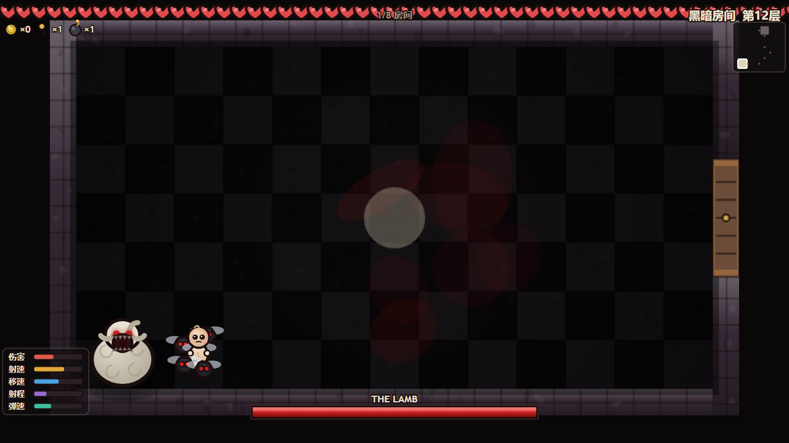
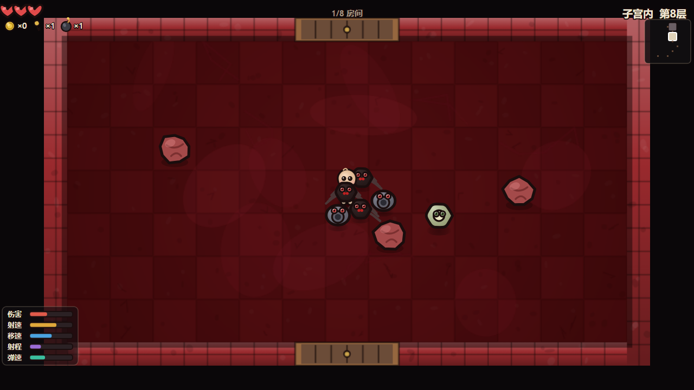
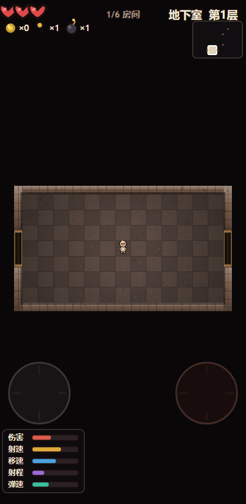

# The Binding of Isaac · Web（网页复刻版）项目介绍

> 用**原生 HTML5 Canvas 2D + 原生 ES Modules** 复刻《以撒的结合》核心玩法的网页肉鸽地牢游戏。
> **零运行时依赖 · 零构建步骤（源码即产物）· 零图片/音频素材** —— 所有美术与音效全部由代码实时生成。
>
> 👉 **在线即玩**：<https://jaxuu.github.io/binding-of-isaac-web/>（打开即玩，无需安装、无需起服务）

---

## 一、项目简介

**The Binding of Isaac · Web** 是一个浏览器端的**地牢肉鸽（roguelike）**小游戏，复刻了《以撒的结合》的**核心玩法循环**：

> 探索随机生成的地牢 → 用眼泪射击清空房间 → 击败本层专属 Boss → 下到更深一层 → 拾取道具不断变强 → 直到通关或死亡。

### 定位

| 维度 | 说明 |
|---|---|
| **类型** | 俯视角双摇杆射击 · 肉鸽地牢 · 单机 |
| **平台** | 现代桌面与移动浏览器（Chromium / Firefox / Safari） |
| **技术形态** | 纯前端静态资源，无后端、无数据库、无网络请求 |
| **体积** | 单文件发行版约 **424 KB**（全部代码 + 样式内联，无外部引用） |
| **代码规模** | `src/` 共 34 个 `.js` 源文件、约 **12,800 行**（其中 33 个进入运行时依赖图） |
| **性质** | 学习 / 研究性质的核心玩法复刻，**非官方作品** |

### 版权关系声明（重要）

- 本项目**不包含任何《The Binding of Isaac》原作的美术、音频、代码或数据资产**。
- 全部角色、敌人、Boss、房间、道具、UI 均由本项目**用 Canvas 2D 路径与渐变代码程序化绘制**；
  全部音效与 12 层配乐均由 **Web Audio API 实时合成**，调式 / 速度 / 音色 / 节奏型均为原创。
- 仅在「玩法机制」与「情绪取向」层面向原作致敬。
- **《The Binding of Isaac》的版权归 Edmund McMillen / Nicalis 所有。**
- 本项目源代码以 **MIT License** 开源（见 [`../LICENSE`](../LICENSE)）。

---

## 二、功能特性

| 特性 | 说明 |
|---|---|
| **12 层地牢，各具视觉主题** | 地下室 → 地窖 → 洞穴 → 地下墓穴 → 深处 → 大墓地 → 子宫 → 子宫内 → 阴间 → 大教堂 → 宝箱 → 黑暗房间。每层有独立的地板 / 墙体 / 环境色 / 装饰母题（岩石 / 头骨 / 血肉 / 火焰 / 黄金）与障碍物材质 |
| **12 个专属 Boss** | Monstro、Larry Jr.、Chub、Gurdy、Duke of Flies、Fistula、Mom、Mom's Heart、Satan、Isaac、???（Blue Baby）、The Lamb。各有独立造型、技能池（散射 / 环形 / 螺旋 / 追踪 / 跳跃 / 踩踏 / 突进 / 激光 / 召唤）与**三阶段曲线** |
| **19 种小怪** | Gaper（追击）、Pooter（飞行远程）、Horf（静止炮台）、Attack Fly / Boom Fly（高速 / 爆炸）、Charger / Hopper / Trite（冲锋 / 跳跃）、Clotty / Spitty / Maw（弹幕 / 追踪）、Mulligan / Host / Vis（召唤 / 潜伏 / 蓄力激光）、Globin / Mulliboom / Maggot / Sucker / Bony（复活 / 自爆 / 爬行 / 抛骨）等 |
| **58 件道具** | 改变**攻击方式**（普通眼泪 / 硫磺火激光 / 抛物线爆炸弹 / 飞刀 / 科技激光 / 穿透弹）、**属性数值**（攻击力 / 射速 / 移速 / 射程 / 弹速 / 生命上限）与**角色外观**（恶魔角 / 皇冠 / 光环 / 翅膀） |
| **逐层程序化配乐** | 12 层各一曲，加载页显示本层曲目名；实现原作「**加重变体**」机制 —— 房间内出现敌人时自动叠加该层的战斗乐器层（吉他 / 低音吉他 / 鼓 / 合唱 / 环境音） |
| **中文 UI** | 标题、HUD、楼层加载页、暂停 / 死亡 / 通关界面全部中文化；属性面板标签为「伤害 / 射速 / 移速 / 射程 / 弹速」 |
| **移动端双虚拟摇杆** | 左半屏拖动 = 移动，右半屏拖动 = 瞄准射击，支持**多点触控**同时操作；桌面端自动隐藏摇杆 |
| **种子复现** | `?seed=任意整数或字符串` 必然生成同一地牢，便于分享与复现 |
| **零依赖 · 零素材 · 零构建** | 无 npm 运行时依赖、无图片 / 音频文件、无打包步骤；改完源码刷新即见 |
| **双击即玩单文件** | `dist/isaac-standalone.html` 自包含单文件，不受 `file://` CORS 限制，可拷贝 / 分享 / 离线运行 |
| **可测试性** | 114 项 Node 逻辑单测 + Playwright 无头端到端渲染验证 + 源码完整性检查 + 发布前烟雾门控 |

### 楼层与配乐对照

| 层 | 楼层中文名 | 专属 Boss | 曲目 | 加重乐器 |
|---|---|---|---|---|
| B1 | 地下室 | Monstro | Diptera Sonata | 吉他 |
| B2 | 地窖 | Larry Jr. | Periculum | 吉他 |
| B3 | 洞穴 | Chub | Sodden Hollow | 低音吉他 |
| B4 | 地下墓穴 | Gurdy | Capiticus Calvaria | 吉他 |
| B5 | 深处 | Duke of Flies | Abyss | 环境音 |
| B6 | 大墓地 | Fistula | When Blood Dries | 吉他 |
| B7 | 子宫 | Mom | Viscera | 鼓 |
| B8 | 子宫内 | Mom's Heart | Viscera (Utero) | 鼓 |
| B9 | 阴间 | Satan | Duress | 鼓 |
| B10 | 大教堂 | Isaac | Everlasting Hymn | 背景合唱 |
| B11 | 宝箱 | ???（Blue Baby） | Sketches of Pain | 吉他 |
| B12 | 黑暗房间 | The Lamb | Devoid | 环境音 |

---

## 三、安装与使用方法

### 方式一 · 在线即玩（推荐 ⭐，打开网址就能玩）

在浏览器直接打开：

**👉 https://jaxuu.github.io/binding-of-isaac-web/**

- **打开即玩**：无需安装任何东西（不需要 Python / Node），也无需起服务；
- 手机浏览器同样能玩（触屏自动显示双虚拟摇杆）；
- 由 **GitHub Pages** 托管，链接稳定、长期有效。

> 想复现指定一局，在网址后追加 `?seed=`，例如：
> <https://jaxuu.github.io/binding-of-isaac-web/?seed=777>。

### 方式二 · 本地双击即玩（离线单文件）

> ⚠️ **前置条件**：需先把本仓库下载到本地 —— 用
> `git clone https://github.com/Jaxuu/binding-of-isaac-web.git`，
> 或在仓库页点 **Code → Download ZIP** 后解压。拿到本地文件后，**双击**打开：

```
dist/isaac-standalone.html
```

- 无需 Python / Node，无需起服务，**无需联网**（可离线运行）；
- 所有代码与样式已内联进这一个文件，**不受 `file://` 的 CORS 限制**；
- 拷到 U 盘、发微信、丢到任意目录都能直接玩。

> 该文件由 `tools/build-standalone.mjs` 把整棵 ES Module 依赖图打包成经典 `<script>` 生成。
> 修改 `src/` 后重新生成：`node tools/build-standalone.mjs`（等价 `npm run build`）。
> ⚠️ 这**不违反「零构建」原则**：日常开发直接跑源码刷新即可见，`build` 仅用于**重新生成分发包**。

### 方式三 · 一键启动本地服务（模块化版本）

想直接跑源码（`index.html` + `src/`）时：

```bash
# Windows：双击，或命令行运行
start.bat

# macOS / Linux
./start.sh
```

脚本会自动起一个 8080 端口的静态服务并打开浏览器。

> ⚠️ **推荐用一键脚本，不要手动起服务**：本机若设了系统代理，`localhost` 请求可能被代理劫持返回 **502**。
> 一键脚本走 `127.0.0.1` 且端口固定，行为更可预期。

### 方式四 · 手动起 HTTP 服务（不推荐）

`index.html` 使用 ES Modules，**必须通过 HTTP 协议加载**（`file://` 会被浏览器 CORS 拦截，表现为黑屏）：

```bash
python -m http.server 8080      # 或 npx --yes serve -l 8080 .
```

### 操作说明

**桌面（键盘）**

| 操作 | 按键 |
|---|---|
| 移动（八向） | `W` `A` `S` `D` |
| 发射眼泪（四向独立） | `↑` `↓` `←` `→` |
| 暂停 / 继续 | `P` 或 `Esc` |
| 菜单确认 | `Space` 或 `Enter` |
| 死亡 / 通关后重开 | `R`（或点按钮） |
| 调试信息（FPS / 实体数） | `F3` |
| 静音 / 恢复（音效 + 配乐） | `M` |

> 移动与射击**方向独立**（双摇杆式），可以一边后退一边朝敌人开火。

**移动端（触屏）**

- **左半屏**按住拖动 → 移动摇杆
- **右半屏**按住拖动 → 射击摇杆（推离死区即持续射击）
- 左右手可**同时**操作（多点触控）
- 支持 iOS Safari / Android Chrome

### 复现指定一局

```
# 在线版本
https://jaxuu.github.io/binding-of-isaac-web/?seed=777

# 模块化版本
http://127.0.0.1:8080/?seed=777

# 单文件版本（双击后手动在地址栏加 ?seed=777 也可）
dist/isaac-standalone.html?seed=777
```

`seed` 支持任意整数或字符串（字符串走 FNV-1a 散列）。同一种子必然生成同一地牢。

---

## 四、目录结构

```
case-yisa/
├── index.html                 # 模块化入口（单 canvas，需 HTTP）
├── styles.css                 # 铺满窗口 + touch-action:none
├── dist/
│   └── isaac-standalone.html  # ⭐ 双击即玩自包含单文件（构建产物）
├── start.bat / start.sh       # 一键起服务（模块化版本的备用入口）
├── package.json               # type: module；仅测试用 devDependency
├── src/                       # 源码（详见下表）
├── design/                    # 设计文档（GDD / 美术圣经 / 移动端规格 / 无障碍）
├── docs/                      # 架构文档、ADR、本介绍文档与截图
├── tests/                     # 测试体系（单测 + 端到端 + 门控）
└── tools/                     # 构建工具（自研零依赖打包器）
```

### `src/` 分层职责

| 目录 | 职责 | 代表模块 |
|---|---|---|
| `src/core/` | **引擎层**：通用、零游戏知识。固定步循环、输入抽象、事件总线、对象池、可种子化随机、数学辅助、Web Audio 音效与配乐总线 | `loop.js` `input.js` `rng.js` `audio.js` `music.js` |
| `src/art/` | **表现层**：全部用 Canvas 2D 代码绘制。调色板、绘制原语、离屏预烘焙、角色 / 敌人 / Boss / 房间 / 投射物 / 道具绘制、粒子与飘字、HUD 与全屏界面、渲染编排 | `renderer.js` `draw-*.js` `ui.js` |
| `src/entities/` | **实体层**：属性重算模型、玩家、敌人、Boss、投射物、道具 | `player.js` `enemy.js` `boss.js` `items.js` |
| `src/systems/` | **编排层**：中央编排器 + 场景状态机、地牢生成与不变量校验、12 层配置中枢、房间运行时与内容生成、战斗结算 | `game.js` `dungeon.js` `floors.js` `rooms.js` `combat.js` |
| `src/ui/` | **交互层**：虚拟摇杆渲染 | `joystick.js` |
| `src/main.js` | 引导装配 + 主循环（装配所有子系统，暴露 `window.__ISAAC__` 便于测试） | — |

### 其他目录

| 目录 | 职责 |
|---|---|
| `design/` | 设计文档：`gdd/`（00 概念 ~ 08 配乐等 9 篇）、`art-bible.md`（美术圣经）、`mobile-controls-spec.md`（移动端控制规格）、`accessibility.md`（无障碍） |
| `docs/` | `architecture.md`（架构）、`architecture-review.md`（架构评审）、`adr/ADR-001~006`（6 条架构决策记录）、`framework-notes.md`（参考 API 笔记）、`screenshots/`（界面截图）、本文件 |
| `tests/` | `run-tests.mjs`（114 项逻辑单测）、`harness.mjs`（Playwright 端到端）、`verify-expansion.mjs`（扩展内容验证）、`verify-standalone.mjs`（单文件 `file://` 验证）、`smoke.mjs`（发布前烟雾门控）、`release-gate.md`（发布门控清单）等 |
| `tools/` | `build-standalone.mjs`：零依赖打包器（ESM → 单文件，含构建期 fail-fast 校验） |

---

## 五、技术栈

| 项 | 选择 |
|---|---|
| **渲染** | 原生 **HTML5 Canvas 2D**（路径 + 渐变 + 阴影），无 WebGL、无游戏引擎 |
| **模块** | 原生 **ES Modules**（浏览器直接加载，无需打包即可开发） |
| **语言** | 原生 JavaScript（无 TypeScript、无转译） |
| **音频** | **Web Audio API** 实时合成（振荡器 / 噪声 / 滤波器 / 包络），零音频文件 |
| **依赖** | **运行时零依赖**；`devDependencies` 仅 Playwright（可选测试工装） |
| **素材** | **零图片 / 零音频文件** —— 美术全代码绘制，音效与配乐全程序化合成 |
| **打包** | 自研 `tools/build-standalone.mjs`：把 ESM 依赖图打平成自包含单文件（含 import/export 白名单校验与符号注入完整性断言，构建期 fail-fast） |
| **测试** | Node 逻辑单测（114 项）+ Playwright 无头端到端（真实 Chromium）+ 源码完整性检查 + 单文件 `file://` 验证 + 发布前烟雾门控 |

### 设计约束（为什么这么做）

| 约束 | 原因 |
|---|---|
| 零运行时依赖 | 任意环境可跑，无供应链风险、无版本腐坏 |
| 零构建（源码即产物） | 开发时改完刷新即可见；`dist/` 单文件是**可选的分发打包**，非开发必需 |
| 零素材 | 无网络请求、无解码、无 CORS；美术全代码生成 |
| 固定 60Hz 逻辑步进 | 手感（弹速 / 追击 / 硬直）与显示器刷新率无关 |
| 可种子化随机 | 地牢可复现，不变量可自动化断言 |

详见 `docs/architecture.md` 与 `docs/adr/`。

---

## 六、界面截图说明

> 以下截图均为**真实运行**的游戏画面（Playwright 驱动真实 Chromium 抓取，固定 `?seed=` 保证可复现），
> 位于本仓库 `docs/screenshots/`。

| 截图 | 说明 |
|---|---|
|  | **标题界面** —— 游戏 Logo、开始按钮与桌面 / 移动端操作说明。 |
|  | **游戏内 HUD** —— 左上血量与金币 / 钥匙 / 炸弹，左下**中文属性面板**（伤害 / 射速 / 移速 / 射程 / 弹速），右上**楼层名与小地图**，顶部中央房间进度。 |
|  | **关卡加载页** —— 显示「第 N 层 + 楼层中文名 + 英文原名 + 本层配乐名」（此图为第 3 层 · 洞穴 · Caves · Sodden Hollow）。 |
|  | **Boss 战（第 9 层「阴间」专属 Boss —— Satan）** —— 恶魔造型 Boss、底部 Boss 血条、玩家踩踏落点警示圈。 |
|  | **Boss 战（第 12 层「黑暗房间」最终 Boss —— The Lamb）** —— 最终层 Boss 与专属暗色主题。 |
|  | **普通房战斗（第 8 层「子宫内」）** —— 小怪群（Trite / Globin / Sucker）与**肉块障碍材质**。 |
|  | **移动端竖屏（420×860）** —— 左移动摇杆 + 右射击摇杆，属性面板自动移至摇杆下方，**不重叠**。 |

---

## 七、已知限制 / 常见问题

### 已知限制

- **非 1:1 复刻**：本作聚焦「核心玩法循环」，道具 / 敌人 / Boss 为精选子集（58 / 19 / 12），
  不包含原作的完整道具池、成就系统、结局分支与双人合作。
- **无存档系统**：刷新页面即重开；进度不复原（可用 `?seed=` 复现地图，但拾取的道具不会保留）。
- **无手柄支持**：仅键盘 / 触屏。
- **纯 Canvas 2D 软件绘制**：无 WebGL 加速，极低端设备在敌人密集时可能掉帧。

### 常见问题（FAQ）

**Q1：双击 `index.html` 打开是黑屏？**
A：`index.html` 使用 ES Modules，`file://` 协议会被浏览器 CORS 拦截。请改用
**方式一**（在线即玩 `https://jaxuu.github.io/binding-of-isaac-web/`）、
**方式二**（本地双击 `dist/isaac-standalone.html`）或**方式三**（`start.bat` / `start.sh`）。

**Q2：手动起服务后浏览器返回 502？**
A：本机系统代理劫持了 `localhost` 请求。请使用 `start.bat` / `start.sh`（走 `127.0.0.1` 固定端口），
或在代理设置中放行 `127.0.0.1` / `localhost`。

**Q3：没有声音？**
A：浏览器自动播放策略要求**先有一次用户交互**（点击或按键）才能解锁音频。点击画面或按任意键即可。

**Q4：桌面端看不到虚拟摇杆？**
A：这是**预期行为** —— 摇杆仅在触屏设备显示，桌面端自动隐藏以免误伤操作。

**Q5：支持 IE 吗？**
A：不支持。需要支持 Canvas 2D、Web Audio、Pointer Events、ES Modules 的现代浏览器
（现代 Chromium / Firefox / Safari，含移动端）。

**Q6：改了 `src/` 想生成新的分发包？**
A：运行 `node tools/build-standalone.mjs`（等价 `npm run build`）重新生成 `dist/isaac-standalone.html`。

---

## 八、许可证与致谢

### 许可证

本项目源代码以 **MIT License** 发布，版权归 **Jaxuu** 所有（见 [`../LICENSE`](../LICENSE)）。
你可以自由使用、修改、分发本项目的**代码**，但需保留版权声明。

> 本项目**不包含任何原作资产**。《The Binding of Isaac》及其全部角色、美术、音乐、商标
> 的版权归 **Edmund McMillen / Nicalis** 所有。本项目为学习 / 研究性质的核心玩法复刻，非官方作品。

### 致谢

- **Edmund McMillen & Florian Himsl** —— 《The Binding of Isaac》原创作者。
- **Ridiculon** —— 原作配乐作曲；本项目的 12 层程序化配乐仅在「情绪取向 + 加重乐器」层面致敬。
- 所有为本项目提供灵感与参考的独立游戏开发者与开源社区。

### 在线体验

**👉 https://jaxuu.github.io/binding-of-isaac-web/** —— 由 **GitHub Pages** 托管，打开即玩，链接稳定、长期有效。

本项目亦曾部署于 EdgeOne Makers（静态托管），但其预览链接携带**临时访问令牌**（会过期，
且属于凭据，不宜写入公开仓库），故不作为公开入口；
如需自行部署，可将本项目托管到任意静态平台（GitHub Pages / EdgeOne Makers / 任意 CDN），
或直接使用本地**方式二**双击单文件离线即玩。

---

*本介绍文档由发布运维流程（REL-DOC-001）生成；截图取自真实运行的游戏，未使用任何占位图或 AI 生图。*
